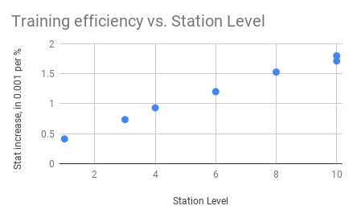
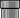

# An Introduction to Tau Station

# Table of Contents
   * [An Introduction to Tau Station](#an-introduction-to-tau-station)
      * [Quick Start](#quick-start)
      * [Attack Warning](#attack-warning)
      * [The Financial System](#the-financial-system)
         * [Credits](#credits)
         * [Bonds](#bonds)
         * [Banks and Your Wallet](#banks-and-your-wallet)
         * [Converting Bonds to Credits](#converting-bonds-to-credits)
      * [Stats and Focus](#stats-and-focus)
         * [Stats Regeneration](#stats-regeneration)
         * [Medical Stims](#medical-stims)
         * [Stats Improvement](#stats-improvement)
      * [Rations](#rations)
      * [What To Do](#what-to-do)
         * [Missions](#missions)
         * [Ruins Scavenging](#ruins-scavenging)
         * [Random Encounters in the Ruins](#random-encounters-in-the-ruins)
         * [Pursue a Career](#pursue-a-career)
            * [Choosing Your Career](#choosing-your-career)
            * [Advancing Your Career](#advancing-your-career)
            * [Career FAQs](#career-faqs)
         * [Side Jobs](#side-jobs)
         * [Discreet Work](#discreet-work)
            * [Discreet Work Tips and Tricks](#discreet-work-tips-and-tricks)
      * [Syndicates](/syndicates)
      * [University Courses](#university-courses)
      * [VIP Packs](#vip-packs)
      * [Travel](#travel)
        * [Emergency Shuttle](#emergency-shuttle)
      * [Player and Station Levels](#player-and-station-levels)
      * [Tiers](#tiers)
      * [Combat](#combat)
         * [Choice of Weapons](#choice-of-weapons)
         * [Weapons Maintenance](#weapons-maintenance)
      * [Clones](#clones)
         * [Dying](#dying)
      * [Reputation](#reputation)
      * [Shipping and Selling Items](#shipping-and-selling-items)
         * [Shipping Items](#shipping-items)
         * [Selling Items to Vendors](#selling-items-to-vendors)
         * [Selling Items on the Public Market](#selling-items-on-the-public-market)
      * [Private Ships](#private-ships)
      * [Bodyguards](#bodyguards)
   * [Tactics, Strategy and Advice](#tactics-strategy-and-advice)
   * [Planned Features](#planned-features)
   * [Resources](#resources)

<!-- Created by gh-md-toc, https://github.com/ekalinin/github-markdown-toc -->

[Tau Station](https://taustation.space/) is a text-based online Massive Multiplayer Role-Playing Game (MMORPG) set
in the future in space, in a post-catastrophic environment.

I (moritz) was a tester in the closed alpha testing phase, and want to document the
things I wished I knew before I started.

This document also contains corrections and contributions from Perleone,
Shadow, Dotsent, Xierumeng and Ovid.

Note that Tau Station is under active development. Hence, parts of this
document might become outdated when the game changes.

Despite the alpha status, the development team has [promised that there
will be no resets/wipes when it leaves alpha or beta
stage.](https://blog.taustation.space/blog/start-your-adventure-in-tau-station-now/)

## Quick Start

Here are a few quick tips when you start playing, and don't want to
read the whole guide just yet.

### Your Safety

* On stations other than Tau Station, you can be attacked by other
  players, who can loot your wallet. Thus you should keep most of your
  credits in the bank, and spend your inactive time in a hotel room at
  the station's Inn.
* The *Bordeaux* and *Caen Stronghold* stations don't have a sick bay,
  so you can die there. Don't travel there until you have a better grasp
  on the game, and on [#clones](clones).

### Your Education

University courses enable new game play, such as steering ships yourself,
repairing items and so on. Since there is only so much you can do to speed
them up, you should *always be enrolled in a University course*. If you cannot
afford the course you actually want to enroll in, it's better to enroll in
one that you can afford than to go uneducated for more than a day or so.

Use the [Tau Education Manager](https://education.tauguide.de/) -- you can
click on the *Cost* column to show you the most affordable courses first. For
more on courses, see [University courses](#university-courses).

### Your Career

You should pick and pursue a career early on, mostly because you can earn lots
of credits from career tasks, and starting from rank 3, the daily bonds are a
very welcome addition.

The *Technologist: Port Technician* career is simple to manage, because every
station has a Port, so you don't need to plan your travels with availability
of career tasks in mind. The *Business: Trader*, *Medicine: Cloning
Specialist* and *Special Services: Operative* careers are also pretty popular,
and offer their own advantages. The other two careers come with clear
disadvantages, as is apparent from [the list of career tasks](/career).

[More about careers here](#pursue-a-career).

### Fun vs. Power Gaming

[Missions](#missions) are the core of a text-based MMORPG, and fun for most
players. However, playing them lead you to level up very quickly, which might
not be in your best interest if you want to build the strongest character
possible.

Leveling up slowly has the main advantage of higher availability of
[rations](#rations) of your own [tier](#tiers), which allows you [more
efficient improvement of your stats](#stats-improvement).

On the other hand, leveling up faster gives you access to better equipment.

Missions, side jobs and career tasks on high-level stations tend to give you
lots of XP, thus leading to faster level-up. Gym training and [discreet
work](#discreet-work) give little to no XP.

### Your Community

Many players join for the game, and stay for the community. You should really
consider joining the in-game chat and saying hello.

You should also join a [syndicate](/syndicates), some of which have very
active and friendly sub-communities of their own, and also bundle lots of
knowledge about the game. Finally, some game play options such as syndicate
campaigns, and (upcoming feature) building construction are only available to
syndicate members.

---

## Attack Warning

Tau Station is policed very well and you are safe there.
Once you visit other stations, you will eventually be
attacked by *raving lunatics*, *single-minded sociopaths*, *coldhearted killers* and
*bloodthirsty psychopaths*. They will bring you to
within an inch of your life and send you to sick bay for
about 16 segments. Unless you're on Bordeaux or Caen, where you
will die. And, adding insult to injury, they will also
loot your wallet and get away with a percentage of the
money you're carrying around.

What can you do to protect yourself? These aggressors
are players of advanced levels with high physical stats
and considerable weapons and armor. So eventually you
will lose the fight. But there are things you can do to
minimize your risk and exposure.

* Always bring your money to the bank, deposits are free
everywhere, and withdrawals at your local branch as well.
Never keep more credits on yourself than you can afford to
lose.
* Always stay in a hotel room (or later on, in your own
private ship). That's the only place
you're safe, and your stats will regenerate faster there.
* Plan your revenge, if you're so inclined. Get together
with other victims, get organized and gang up on the
perpetrator.

## The Financial System

There are
[*credits*](https://blog.taustation.space/blog/taking-credit-a-virtual-economy/) and
[*bonds*](https://blog.taustation.space/blog/bonds-explained-a-virtual-economy-part-2/).

### Credits

Credits is everyday money that you can
earn pretty easily. With credits, you can pay for things such as hotel
rooms, public shuttles for inter-station and inter-system travel, University courses, and weapons and armor.

Finally, you can buy your own [private ship](/ships), starting from "just"
210,000 credits.

You can earn credits through

* successful career tasks
* selling items (for example found in the Ruins/Wrecks)
* daily career payments
* side jobs
* discreet work
* combat, followed by looting the opponent
* leveling up
* missions (though most missions don't pay well financially)

### Bonds

Bonds are harder to earn, and can be used to pay for things that make
playing easier or faster:

* accelerating University courses
* VIP packs
* bribing for extra rations
* boosting training
* bribing for shorter confinement times
* reducing private ship repair, fuel-up and refurbishment times
* premium clones
* faster release from the Brig (prison) and Sick Bay
* [instantaneous](https://alpha.taustation.space/coretechs/archive/technology#/quantum-telepheresis) [intrasystem](https://blog.taustation.space/blog/benevolent-dynamics-presents-quantum-telepheresis/) travel and faster interstellar travel
* premium avatar images

This list is roughly sorted by utility. VIP packs and accelerated
University courses are a pretty good way to spend bonds, while I'd only
use bonds for fast or instantaneous travel if there was a very good reason.

You can obtain bonds in the following ways:

* you can buy them in the shop (currently disabled)
* as a daily reward for your career level (up to 30 bonds per day)
* sometimes, discreet/anonymous work has a small bonds reward
* As a reward for successful *Enter the Sewers* campaigns (up to 15 per day)
* you can find bond certificates in the Ruins
* if you level up to a new [tier (if you reach levels 6, 11, 16, etc.)](#tiers),
  you get a reward of 500 bonds

### Banks and Your Wallet

You can have credits in your wallet and in your bank account.

From your wallet, you pay most of your everyday purchases like shuttle
fees, item repairs, hotel rooms etc, with
the exception of things you buy from the Public Market (which
directly withdraws from your bank account).

Credits from your wallet can be looted if somebody wins a fight against
you, and are lost if your character dies.

Bonds are always kept in the bank, but you can pay them directly without
visiting the bank.

At your home branch, withdrawing credits is free. At other branches,
the withdrawal fee is 3%, or 1% if you are VIP
(with the exception of Caen Stronghold, where the fee is always 3%).

You can transfer your home branch to any Consortium station, and then
benefit from free withdrawal at that branch. The account transfer fee
only depends on the target station level, not on the account balance.
For big purchases like higher-level University courses or private ships,
transferring the bank and then withdrawing for free can be cheaper than
paying the withdrawal fee.

Deposits are free at any bank.

The following table summarizes what is payed from the wallet and what
is payed from your bank account:

| Action/Service    |  Payment                  |
|-------------------|---------------------------|
| Bodyguards        | Wallet with Bank fallback |
| Hotel Room        | Wallet                    |
| Items at Vendors  | Wallet                    |
| Public Market     | Bank                      |
| Shuttles          | Wallet                    |
| Shipment costs    | Wallet with Bank fallback |
| Buying Ship       | Wallet with Bank fallback |
| Refurbish Ship    | Wallet with Bank fallback |
| Repair Ship       | Wallet                    |
| Ship Fuel         | Wallet                    |
| University course | Wallet                    |
| Bodyguards        | Wallet with Bank fallback |

In case of the bank fallback, withdrawal fees apply.

### Converting Bonds to Credits

There is no way to convert credits to bonds.

The bank offers you to convert bonds to credits at a 1:5 conversion
rate, but that is a pretty terrible exchange.

You get a better rate if you go to the vendors at the Market, and buy
a 3-day VIP pack for 290 bonds (which you can do once every 7 days).
You can sell this at the Public Market for somewhere between
55,000 and 65,000 credits (of which you need to pay 10% as market fee).
Before you do that, ask in the chat if anybody is willing to buy it, and
at what price point.

That way, you get a conversion rate of 1 bond to 172..203 credits.

If you don't have enough money to afford the seller's fee on the market,
you can try to find a potential buyer for the VIP pack in the chat, and
maybe they'll help you.

The process goes something like this:

* The two of you agree on a price for the VIP pack
* You find or buy an insignificant item like a Capacitor or Beer Bottles
* You put it up on the Public Market for 1/10th of the agreed-upon price
* The designated buyer buys the item from the Public Market
* You use the money earned that way to pay the listing fee of the VIP pack

If you don't even have a 1/100th of the agreed-upon price, you might
need to conduct this process twice.

Of course, this process requires that the designated buyer trusts you
not to run away with the money before the final VIP pack sale.

Note that you use the same process to buy VIP packs for real-world money,
and turn them into credits that way.

Another way to convert bonds to credits is to pay 20 bonds bribe for an extra
ration (which you can do once every 24 hours), and sell that ration on the
Public Market. Tier 2 rations tend to sell for somewhere between 1800 and 2000
credits, giving you a slightly worse conversion ratio to the VIP pack trading.

## Stats and Focus

Whenever you try something, and the success is not a foregone
conclusion, you use up some of your *Focus*, and one of the five
*stats*: Strength, Agility, Stamina, Intelligence, Social.

### Stats Regeneration

Every five minutes, your Focus and stats automatically regenerate. The
rate of regeneration is higher if:

* you are currently a VIP
* you are "well fed" from consuming a ration earlier
* you are in your hotel room
* you have completed one or more of the "Anatomy" University courses, available
  on the Nouveau Limoges station

The regeneration acceleration from staying in a hotel room only kicks in if
you have spent the current and the previous regeneration cycle exclusively in
your hotel room.

Regeneration is slower if you are confined to the Sick Bay or the Brig.

The following things immediately fill your stats and Focus:

* consuming a VIP package
* consuming a [ration](#rations) of your own [tier](#tier) or above
* leveling up

Consuming [stims](#medical-stims) and drinking at the bar can also instantaneously
increase a stat a bit, though at the price of raised toxin levels
(for stims), or at consuming Focus and risk of injury (drinks at the bar).
Both are usually not worth the risks and downsides.

The following recovery rates have been compiled by mostly [Shadow and Dotsent](https://alpha.taustation.space/forum/discussions/topic/197-04-88-143-please-use-this-thread/post/197-53-01-501-stat-recovery):

|Booster                                | Focus/%   | Stats/% | Measured   |
|---------------------------------------|-----------|---------|------------|
| None                                  | 3         | 3       |            |
| Healthcare 1                          | 2.3333    | 2.3333  | 2018-06-21 |
| Healthcare 2                          | 2..3      | 2..3    | 2018-03-19 |
| Healthcare 3                          | 2..3      | 3       | 2018-03-27 |
| Hotel                                 | 4         | 4       |            |
| Hotel + Healthcare 1                  | 4.4       | 4.4     | 2018-06-21 |
| Hotel + Healthcare 2                  | 4..5      | 4..5    | 2018-03-19 |
| Hotel + Healthcare 3                  | 5         | 5       | 2018-03-27 |
| Well Fed                              | 4         | 4       |            |
| Well Fed + Healthcare 1               | 4.4       | 4.4     | 2018-06-21 |
| Well Fed + Healthcare 2               | 4..5      | 4..5    | 2018-03-19 |
| Well Fed + Healthcare 3               | 5         | 5       | 2018-04-03 |
| Hotel + Well Fed                      | 5         | 4       |            |
| Hotel + Well Fed + Healthcare 1       | 6.5       | 6.5     | 2018-06-21 |
| Hotel + Well Fed + Healthcare 2       | 6..7      | 6..7    | 2018-03-19 |
| Hotel + Well Fed + Healthcare 3       | 7         | 7       | 2018-04-03 |
| VIP                                   | 6         | 6       |            |
| VIP + Healthcare 1                    | 10        | 6..7    | 2018-03-13 |
| VIP + Healthcare 2                    | 10..11    | 6..7    | 2018-03-17 |
| VIP + Healthcare 3                    | 11        | 7       | 2018-05-18 |
| VIP + Hotel                           | 10..11    | 6..7    |            |
| VIP + Hotel + Healthcare 1            | 12..13    | 8..9    | 2018-03-13 |
| VIP + Hotel + Healthcare 2            | 10.1      | 6.75    | 2018-03-18 |
| VIP + Hotel + Healthcare 3            | 13..14    | 9..10   | 2018-05-17 |
| VIP + Well Fed                        | 12..13    | 8       |            |
| VIP + Well Fed + Healthcare 1         | 13        | 8..9    | 2018-03-13 |
| VIP + Well Fed + Healthcare 2         | 14        | 9       | 2018-08-25 |
| VIP + Well Fed + Healthcare 3         | 13..14    | 9..10   | 2018-03-17 |
| VIP + Well Fed + Hotel                | 12..13    | 8..9    |            |
| VIP + Well Fed + Hotel + Healthcare 1 | 16        | 10..11  | 2018-03-13 |
| VIP + Well Fed + Hotel + Healthcare 2 | 17        | 11      | 2018-08-25 |
| VIP + Well Fed + Hotel + Healthcare 3 | 17        | 11..12  | 2018-05-18 |

(values without a measurement date have been assembled before 2018-03-17 and may be less reliable)

There are also consumable food items available at NPC vendors that temporarily
increase your total stat value (not your current percentage). Those are
Genotype dependent, and Baseline characters benefit half from them.

### Medical Stims

*Information in this section is a result of [Medical Stims research](https://alpha.taustation.space/forum/discussions/topic/197-04-88-143-please-use-this-thread/post/198-61-63-060-medical-stims-research-looking-for-test-subjects). Huge thanks to Praxibetel, Jaidan, Shadow, Vorkosigan, Groat, Aell and moritz for contributing the datapoints for this study! --Dotsent*

There are currently up to 30 different types of regular medical stims in the Tauverse that differ by the following parameters:

* Tier (only Tier 1 and 2 regular stims exist)
* Potency (Minor, Standard or Strong)
* Affected stat (AGI/STR/STA/INT/SOC)

In addition, there are *multi stims* that boost several stats at once. Those
go up to Tier 5 and can only be acquired from Enter the Sewers campaigns.

Besides those parameters which are shown directly in the title (example: "Strong Stamina Stim, v2.3.004"), each stim has also the following numbers in its in-game information page:

* Toxicity
* Stat boost

They are related to Tier and Strength of the stim as follows:

| Tier | Potency  | Boost | Toxicity |
|------|----------|-------|----------|
| 1    | Minor    | 5.5   | 0.1      |
| 1    | Standard | 6     | 0.07     |
| 1    | Strong   | 6.5   | 0.05     |
| 2    | Minor    | 6.875 | 0.1      |
| 2    | Standard | 6.875 | 0.07     |
| 2    | Strong   | 7.5   | 0.05     |

*(there is no mistake, Minor and Standard Tier 2 stims indeed have the same Boost value)*

If you take a medical stim, this results in one of the following outcomes:

* You get a certain percentage of the stat(s) that this stim affects and your Toxins percentage rises as well
* You get no stat boost, your Toxins percentage rises to 100% and you land in the Sick Bay immediately

In order to avoid the second outcome, it's always wise to use the Toxicity calculation formula before taking any stim.

#### Medical stim toxicity calculation formula

**Toxicity = (player_tier-stim_tier + 1) x stim_toxicity x 100%**

This means that if you take a stim that's of the same [tier](#tiers) as you, you'll gain the toxicity equal to stim's declared Toxicity percentage. However, if you are taking a stim one tier lower than yourself, you'll gain double of the stim's declared toxicity, if you are two tiers higher than the stim, you get triple of the stim's declared toxicity etc.

#### So, what's the gain? (Stat boost)

The stat boost is calculated by the following formula:

**Boost = (`stim_boost` / `player_max_stat_value`) x (0.5 + 0.25 x `player_stims_skill_level`) x 100%**

Components of this formula:

* `stim_boost` - internal stim's Stat Boost number, from 5.5 to 7.5 (or even higher for high-tier multi-stims)
* `player_max_stat_value` - maximum value of player's particular stat that is affected by the stim
* `player_stims_skill_level` - a value that depends on player's finished University courses, specifically Medical Stims, Medical Stims Specialization and Medical Stims Mastery. At the moment of writing this there were no active players who have completed Mastery course, so the formula was only tested for the values 0, 1 and 2.

The resulting percentage is rounded for display, so it might actually show 1% larger gain than calculated.

Given that the result has an inverse dependency on player max stat value and
that high-level players tend to have quite well developed stats, the conclusion is:

**The stims are mostly useful if they match the player's tier. However, after the last update on stims functionality even lower-level stims can moderately help even higher-level players in combat or outside it.**

### Stats Improvement

Most stations (all except the jump gates) feature a [Gym](https://alpha.taustation.space/travel/area/training), where you can
invest focus and current stat values to train the physical stats
(*strength*, *agility*, *stamina*).

You can train *intelligence* in a similar fashion in a [hotel room](https://alpha.taustation.space/area/hotel-rooms/enter-room) of an
Inn, or at a University (scroll to the very bottom of the page). All
stations,  and five
stations have a University (Tau, Nouveau Limoges, Moissan, Spirit of
Botswana, Cape Verde Stronghold).

You can also train intelligence while traveling with public shuttles or in
your private ship.

The *social* stat can be trained at the [Lounge](https://alpha.taustation.space/travel/area/lounge) that belongs to an inn.

The efficiency of training of any of these stats depends on the station.
In general, higher-level stations yield better training benefits. For
example on Tau Station (level 1), you get about a 0.004 stats increase
for every 10% of focus that you invest. On Yards of Gadani (level 10),
the stat increase is around 0.019.

The training efficiency is roughly 0.3 + 0.15 * StationLevel, in 1/1000 points
stat gain per Percent focus invested.

The training efficiency on shuttle/ship rides is the same as training on
the destination station.

Training also depends on the character's
[genotype](https://alpha.taustation.space/archive/genotypes), because
genotypes have pre-dispositions for certain traits. Belters, for
instance, find it easier to train Agility (where they get a 5% bonus)
than Strength. All genotypes except Baseline have one stat with +5% bonus,
one +2% bonus and a -5% handicap.

| Genotype  | Strength | Agility | Stamina | Intelligence | Social |
|-----------|----------|---------|---------|--------------|--------|
| Belter    |   -2%    |   +5%   |         |      +2%     |        |
| Colonist  |   +5%    |         |   +2%   |              |   -5%  |
| Harsene   |          |   -5%   |         |      +5%     |   +2%  |
| Mall      |   +2%    |         |   +5%   |      -5%     |        |
| Patrician |          |   +2%   |   -5%   |              |   +5%  |

Training can lead to injury (and thus unconsciousness or time in the
Sick Bay) if your stats are too low. Each gym has a minimal sum of
combined physical stats that you need to avoid injury, starting with 30
at Tau Station and going up to 45 at Amazon and Maid of Orléans.
Slightly higher limits (though not explicitly denoted) apply to training of the
social and the intelligence stat.

If you are repeatedly injured or becoming unconscious or detained from
training, go back to a lower-level station, increase the relevant stat
there, and then try again at the higher-level station.

Stats can also randomly increase as a bonus of successfully completed
discreet work.

Finally, the primary and secondary stat of your career improve once
per day, taking place at the same time as your salary payment.

### Stats Benefits

Above-average stats grant you additional benefits besides the higher
success rates of tasks and checks:

* High *Intelligence* speeds up University courses
* High physical stats lets you carry more mass before encumbrance kicks in.
* High *Strength* increases the damage you do in combat
* High *Stamina* decreases the damage you receive in combat
* High *Agility* improves the chances to flee from combat, and increases the
  success rate while attacking
* High *Social* grants you advantages when buying from or selling to NPC vendors
* High physical stats are harder to drain during combat, so they act as
  protection against attacks.

During discreet work, higher stats lead to reduced stats consumption for each
check.

## Rations

You can survive without explicit use of rations. But, each time you
consume a ration, it immediately fills up all of your stats and your
Focus.

If you consume a ration of a [tier](#tiers) one lower than your character's, the
immediate regeneration is incomplete (around 60% to 67%). A ration two tiers below your
current tier gives hardly any immediate regeneration. Rations which are three
or more tiers below your current tier are absolutely useless for regeneration.
You can either sell them on the public market or gift them to other players.

Rations above your own tier work the same as stats of your own tier.

Rations also give you the "well fed" status for 32 segments (roughly 8
hours), which increases stats and Focus regeneration. For rations of a
lower tier, the "well fed" status is shorter (10 segments for a tier
difference of two). "Well fed" stacks up if you consume multiple rations.

### Sources of Rations

* You are automatically assigned one ration per day, which you can fetch
at any station's Government Center, except Caen Stronghold.
* You can spend bonds as bribes for more rations at each station's Government
  Center, though the price doubles each time you do it in one day, and drops back
  to the original price (20 bonds) 92 segments (almost one day) after your first bribe.
* You can buy them off the Public Market when other players sell them there.
* You can buy rations from NPC vendors on Caen Stronghold (Barnard's Star),
  for variable prices starting from around 1095 credits per tier.
* You can find rations in the Ruins, with the ration tier depending on the
  station level.
* Sometimes they are awarded as the random reward for doing discreet work,
  depending on the station (for example Orwell Stronghold awards tier 3
rations, and YZ Ceti Jump Gate tier 4 rations).
* Rations are also often the reward of successful combat following random
  encounters in the Ruins on certain stations (Nouveau Limoges (Sol), Yards of
  Gadani and Bordeaux (Alpha Centauri) drop tier 2 rations, Caen Stronghold and Hopkins' Legacy
  (Barnard's Star) drop tier 3 rations, Spirit of New York City drops Tier 4
rations)

## What To Do

As in every RPG, there are several different things you can do, with
different resource requirements and payoffs.

### Missions

Missions are fun! They are interactive, text-based stories where your
choices select one of many possible paths.

You can find a mission by clicking on the "Find a
mission" link in the "Employment" box. A mission opportunity is marked
by the orange action flag, either in an area or next to a person.

During missions, you typically invest focus and some stats. After you
have finished the missions on Tau Station, you must travel to other
stations to find missions, and those missions might again prompt you to
travel to other stations, which costs you credits (and there are missions that
require at least three interstellar travels). Also, sometimes bribing
somebody with your own credits is the easiest way to convince an NPC to
collaborate. There are situations where you seem to be at a dead end, which
can be fixed by having enough credits in your wallet.

Missions are the primary source of experience, and also give you a
small financial reward. Some missions reward you with items, such as
weapons or armor. The *Education* mission on Estación de Amazon,
Barnard's Star can give you a sizable boost to your Stamina.

But most
importantly, missions are interactive short stories that are enjoyable
to read and experience.

Some missions also build on other missions, and you can only engage in
the later missions if you completed the previous missions successfully.

There is also a mission (*In the Crossfire* on Hopkins' Legacy, Barnard's
Star) that depends on having completed a side job (*Wall Maintenance* on
the same station).

Note that some missions send you to other stations, sometimes even to other
stars. Usually, the mission's financial reward does not compensate you
fully for the travel costs.

I advise to play all missions available to you, unless you are actively trying
to avoid leveling up.

### Ruins Scavenging

All stations have a *Ruins* area with the *Wrecks* sub-area, where you can
scavenge for discarded
stuff. Each search costs 10% stamina, and if you find something,
also 10% of Focus. Each successful find
also adds to your experience.

The things you can find in the ruins include (in decreasing likelihood):

* nothing
* common trade goods (sell for less than 1 credit)
* stims
* weapons
* armor
* rare trade goods (sell for 5000 credits or more)
* bond certificates
* VIP packs
* rations

What you can actually find in the Wrecks is partially dependent on the station
you are searching on. For example the weapons and armor you can find tend to
be similar to those you can obtain through *Look for Trouble*, and the common
trade good *Circuit Board* is usually only found at Barnard's Star. On the
other hand, most trade goods and bond certificates seem to be equally distributed
to all stations.

You can carry around what you find, up to a certain mass limit. If you
carry around too much, you will get a warning that you are encumbered,
and lower success rates for tests against the physical stats, and moving
to a different area of the station reduces the physical stats.

Depending on your level of encumbrance, you can lose up to 10% of each
physical stats with every move to the different area of the station.
If one of your physical stats reaches 0 because of encumbrance, you will
lose consciousness and be taken to Sick Bay (or simply become unconscious),
so try to offload heavy items at the first opportunity.

If you don't want to carry around stuff, you can sell it to the vendors,
(go to Market → Vendors and then to your Inventory), to other players
(go to Market → Public Market and then your Inventory), or store it
(go to Market → Storage,
buy storage if you haven't yet, and then to your Inventory), or drop them
right from the Inventory.

On stations without a Market (for example the Jump Gates) you can still
avoid encumbrance by going to Port → Shipping Bay, and sending the items
to yourself on another station, where you can later pick them up and
sell or send them to storage there.

Common trade goods are mostly an annoyance, but some players hypothesize
that they might serve as the raw material for crafting items or building
syndicate buildings, when these features will be implemented in the future.

You can sell rare trade goods for significant credits at the NPC vendors,
or use them as a means to transfer money to other players without paying
the 10% market fee.

### Random Encounters in the Ruins

In the Wrecks sub-area of the Ruins you can also search for random encounters
(*Look for trouble*).  Each search costs
5% Agility and Stamina each, and 10% Focus. When you
find somebody, you can engage in
combat with them (but you don't have to do so immediately; you can, for
example, consume a ration or even retire to your hotel room first for
some stats replenishment).

Upon finding an opponent in the Ruins, you have 8 segments to fight them.

When you win such a fight, you loot the opponent, which tends to give
you on the order of 1 to 100 credits, and you gain a reward. The reward
on lower-level stations is often a piece of armor or a weapon, and on
higher-level stations it can be a ration. For example on Hopkins' Legacy
and on Caen Stronghold, the reward is almost
exclusively tier 3 rations.

You also gain experience from victorious combat, more so than from career
tasks.

After finding an opponent, you cannot engage in another random encounter
for the next 8 segments. You can halve this waiting time by spending 10 bonds.

If you lose in combat, you are sent to the Sick Bay for recovery, or die on
Bordeaux Station and Caen Stronghold (which don't have a sick bay).

Many new players seem to have a very hard time doing combat in the ruins,
so I'd recommend to wait until you have reached level 6, which comes with
access to much better weapons and armor.

Starting from level 5, you can also *Enter the Sewers*. The sewers are
accessible at *København* and *Taungoo* in the Sol system, and at *Moissan*, *Cirque
Centauri* and *Yards of Gadani*. in the Alpha Centauri system. Stations 
*The Maid of Orléans*, *Spriti of Tianjin* and *Spirit of New York City* are
the only stations with open sewers in their respective systems.
This gives you a list of six opponents that you can attack in order, with the
second becoming available once the first has been defeated, and so on.

In contrast to
*Look for trouble*, the reward is shown before you attack the opponent,
and includes 5 bonds for the third and 10 bonds for the sixth opponent.
The level of the *sewers* opponents are one to two levels above the
player level, so for higher-level players, they can be much stronger than
the *look for trouble* opponents.

The final opponent also gives you two random rewards, one of which can be an
item or a bond package, the other one is a (multi) stim of the player's tier.

The cool-down period for *Enter the Sewers* is 92 segments (about 22 hours),
which you can also halve by spending 10 bonds.

### Pursue a Career

You can and should pursue a career. Performing career tasks is the most
reliable source of credits, and once you have been promoted a few times,
the largest reliable in-game source of bonds.

#### Choosing Your Career

When I picked my career, I read through the descriptions, and picked the
one that sounded best. You should be more strategic in your choice.

The first factor you should consider is the primary and secondary stat
associated with the career tasks. You should favor a career that makes
use of Intelligence, because in the context of University courses, it
makes sense to boost that stat anyway. If you are planning
on doing Player-vs-Player combat, you should favor a career that uses
physical stats, because then the stat bonus contributes to your combat
ability.

The second factor is availability. Career tasks can be tied to locations
(you can only repair ships at a Port, and only analyze security footage
at Security), and not all stations have all areas. Ports and Brigs are everywhere,
Sick Bay and Security are also nearly ubiquitous. There are several stations
without cloning vats.
In contrast, only five stations have Gaule embassies, which are useful for the
Law career. This is mostly a concern in the early stages of careers; starting
from around rank 7, many tasks can be done anywhere, or often in areas that
are available on all or most stations.
 
Finally, some careers are more dangerous than others; if a majority of
tasks sound illegal, you might spend quite some time in the Brig.
(Though illegal tasks tend to pay better than comparable legal
tasks).

See the [separate career page](/career) for a list of tasks per career.

Note that you can abort your career at any time, and even later return
to that career with no repercussions, except of course the time you
missed advancing your career.

#### Advancing Your Career

You advance your career by succeeding at career tasks. You go to
different areas of the station, and click on the "Tasks" tab, and then
attempt some tasks. The [career overview
page](https://alpha.taustation.space/career) lists all available tasks
on your current station, and where you can try them. If the area a task
depends on does not exist at the current station, the task will not be
listed.

Each success adds to your career experience, and each failure
of the same task reduces your career by half of that amount.
The experience roughly correlates with the bonus.

Each night at midnight CET, or around GCT /95:900, the number of days you
have spent in a career rank increases.
At the same time, you receive your regular payments of bonds and credits,
depending on your current career rank.

Once your career experience is at least 100% *and* you have spent
enough days in the current career rank, you
are promoted. If you fail enough tasks, you can also be demoted again.

The minimum number of career days per rank increases exponentially: you can get
promoted after 2 days in career rank 1, after 4 days in rank 2, 8 days
in rank 3 etc., all the way up to 128 days in rank 7.

|Rank | Min days in rank  | Daily bonds |
|-----|-------------------|-------------|
|   1 |                2  |           0 |
|   2 |                4  |           0 |
|   3 |                8  |          10 |
|   4 |               16  |          10 |
|   5 |               32  |          20 |
|   6 |               64  |          20 |
|   7 |              128  |          30 |
|   8 |              N/A  |          30 |

Career tasks use up 20% of the affected stat, and 5% focus. On success,
you get a bonus in credits (between 9 and 369, depending on the difficulty
of the task and the career), which is the primary source of most player's
credit wealth.

The career task bonus is also affected by a time- and station dependent factor
between 1 and 2. Many systems have a station that often has a high career
factor, which you can explore [on the career page of the Tau
Tracker](https://tracker.tauguide.de/career).

At the very beginning, you will only be able to perform the most basic
tasks, with payouts of 9 credits, which are annotated as *Easy* or
*Normal*.

As your career experience and rank increases,
more difficult career tasks become achievable. In general, you should
try career tasks where your success rate is higher than 50%. If your
success rate is higher than 80% or 90%, you might try more difficult
tasks (which are those further down the list), because they yield higher
returns.

The spread between the lowest and highest task bonuses is much larger
(factor ~40) than the career XP gain spread (factor 8-10). Hence if
you primarily want to advance your career, you should stick to lower-level
tasks for which you have a high success rate. If you want to optimize for
making credits fast, doing the harder but better-paying tasks is the
better strategy.

#### Career FAQs

##### How Can I Check My Career Progress?

The career experience is shown on your [character
page](https://alpha.taustation.space/) in the *Career* section.

#### What Determines Career Task Success Rates?

There is no official documentation on what contributes to career success,
so the following list might not be totally accurate or complete, but
seems to explain most phenomena around career tasks:

* Intrinsic task difficulty.
* Career experience
* Current percentage of the stat that is being tested
* Station level, with tasks being easier on lower-level stations.
* Player level. Many players have reported more failing career tasks after
  leveling up.

Some players have reported that career task success rates have gone
down after they have leveled up, even though their stat ranking has stayed
the same. Either the stat ranking is more granular than the few steps that
are exposed to the user, or there is another factor at work that incorporates
the player level.

### Side Jobs

Side jobs are brief, one-off jobs that pay a fixed reward. They consist
of tests against the same stat until you have passed five of them. They
pay less than career tasks, but give you much more experience.

The available side jobs and their pay depend on the station.

The narrative of some side jobs gives you background information about life on
the current station.

### Discreet Work

*Discreet Work* aka *Anonymous Missions* are automatically generated
missions that, on completion, give you a small amount of credits, and
more importantly, a random bonus. This bonus can be

* more credits
* an increase in one stat
* a weapon or armor
* a ration
* a stim

In most cases, the potential rewards depends on the station level. For
example on *Taungoo Station* (level 5), the stats boost tends to be on the
order of 0.02, while you get something closer to 0.04 on *Yards of Gadani*
(level 10). The stat bonus also depends on the station. For instance, on
*Hopkins' Legacy* the stat bonus is always for Strength, while on Yards of
Gadani it is for Social, Strength and Stamina. See the [Taustation
wiki](http://taustation.wikidot.com/discreet-work) for more details.

Completing discreet work also improves your [reputation](#reputation) with the
affiliation of the government that controls the current station, which
in turn leads to shorter Brig times when you get caught doing something
illegal, and to some vendor discounts.

Some of the anonymous missions involve stealing an item from somebody,
and bringing it to somebody else. Between those two actions, the item
is in your own inventory, and you can steal it by aborting the mission.
The only repercussion is that after aborting an anonymous mission, you
won't be offered a new one for a while (around 16 segments). For valuable
items such as rare weapons or rations, this might be worth it.

Despite the disclaimer of potential danger, Discreet Work has never
brought me into the Sick Bay or the Brig.

Discreet Work tasks consume 20% of a stat if it is "Average", and 5%
if it is "Exceptional". Failed tasks do not consume any Focus,
successful tasks  consume 10%.

Discreet Work is limited to 50 missions per 24 hours.

#### Discreet Work Tips and Tricks

* Don't try to be clever when doing Discreet Work; for example, what it
says "you must find Aearis Tinsley", you won't find her by looking through
all areas of the current station; you have to follow the mission steps.
* If you can't seem to find your next step, the [mission
  overview](https://alpha.taustation.space/mission) should help you find it.
* You can start discreet work while being on a mission. The link for discreet
work isn't shown while you are pursuing a mission, but if you [follow this link to discreet work](https://alpha.taustation.space/area/discreet-work), you can start it anyway.

## Syndicates

Syndicates are Tau Station's group play feature, currently under heavy
development. Please see the [the separate page on syndicates](/syndicates)
for more information.

## University Courses

University courses can teach you handy skills. You have to pay some
credits to enroll in one, and can optionally spend bonds to speed them
up. The basic courses are relatively cheap (typically around 200 credits
and fast, while more advanced courses take much longer (up to 28 days),
and can cost up to several ten thousand credits.

You can only be enrolled in one course at a time, and you cannot abort a
course that you started. Travel, Sick Bay, Brig and even death do not affect
a University course in progress, which just continue in those circumstances.

In the beginning, you can likely only afford basic courses, so you
should enroll in those.

Having an above-average intelligence (as shown by the stats ranking on
your character page) makes courses faster. With "Exceptional" intelligence,
you can reduce time to completion by 15%. You can also spend 99 bonds
to speed up the course by 50%, so the combination of both reduces
the time to 35% of the original length.

University courses are a long game. A typical module consist of courses
that last 1, 7, 14 and 21 days, so more than 6 weeks total, and even with full
acceleration it's more than two weeks. Thus you should be enrolled
in a course all of the time to get the most of out it.

One module that can be generally recommended is the collection of
Anatomy courses available on Nouveau Limoges, since it boosts stats
recovery -- something that is useful no matter what career you pursue.

Most courses only have negligible benefits on their own, but if you finish
several related courses, the compound effect is typically noticeable.

The following modules are available, grouped by station:

* Tau Station (Sol; Consortium)
    * Business: Bureaucracy
    * Combat: Combat Basics, Intermediate Combat, Defensive Tactics
    * Engineering: Basic Engineering
    * Spaceship Operations: Navigation, Technology
* Nouveau Limoges (Sol; Gaule)
    * Engineering: Basic Engineering
    * Medicine: First Aid, Anatomy
    * Psychology: International Relations
    * Spaceship Operations: Navigation, Technology
* Moissan Station (Alpha Centauri; Gaule)
    * Medicine: First Aid
    * Spaceship Operations: Navigation, Technology
* Spirit of Botswana (Alpha Centauri, Consortium)
    * Combat: Combat Basics, Special Ops
    * Spaceship Operations: Navigation, Technology, Ship Handling
* Cape Verde Stronghold (YZ Ceti, Consortium)
    * Advanced Ship Engineering
    * Construction
    * Space Navigation (Multi-Jump courses)

See the [search- and sortable list of all University
courses](https://education.tauguide.de/) for details. Here is just a
quick breakdown:

The *Anatomy* module consists of *Healthcare*, which speeds up stats
and focus recovery slightly, and *Self-Surgery*, which speeds up recovery
in the Sick Bay.

*Intermediate Combat* unlocks the combat belt, which allows you to carry
stims during combat (which can quickly regenerate a stat).

*International Relations* seems to make it easier to convince other people
to do things (so corresponds to an increased *Social* skill).

The *Item Repair* courses from the *Engineering* module allows you to
repair weapons and armor on your own, instead of having to pay for it,
and serve as prerequisites for the *Ship Engineering* module.

The *Spaceship Operations* module contains *Navigation*, *Technology*
and *Handling* To be able to purchase a ship, you'll
need (in that order): Navigation 1 and 2, Technology 1 and Handling 1.

Additional *Ship Engineering* and *Advanced Ship Engineering* modules allow
you to improve the fuel efficiency and damage resistance of your ships, as
well as shorter Jump Gate travels.

The *Advanced Ship Engineering* courses reduce ship repair time (and possibly
cost).

*Space Navigation* courses allow you to do several consecutive interstellar
jumps without interaction in between, though at the cost of increased travel
time.

The *Construction* courses are prerequisites for syndicate buildings, a
feature that is not yet implemented in Tau Station.

## VIP Packs

VIP packs provide many benefits, documented
[here](https://taustation.space/blog/shop-grand-opening-next-steps/).
The most important ones are 150% Focus, much faster stats regeneration, and
larger experience gains.

Playing with an active VIP pack is significantly more fun and more
efficient. When you first use one, all your stats go to 100%, so it
makes sense to exhaust your stats through career tasks or so before you
use one.

The following are sources of VIP packs:

* You can buy them in the shop
* You can buy a 3-day VIP pack every 7 days at the Vendors (Market), for 290 bonds
* You can buy VIP packs on the Public Market when other players are willing to part with them.
* You can find VIP packs in the ruins
* Syndicate campaigns

You can also sell VIP packs on the Public Market, for up to 20,000 credits per
day of VIP, with a slightly higher per-day value for smaller packs.

VIP packs are all of tier 1, but work regardless of player tier.

## Travel

You can travel from station to station within a star system through
local shuttles. If you want to travel to a station in another star
system, you first need to travel to a jump gate, from there to the other
star system's jump gate, and from there to the station you want.

Currently all systems have a direct connection to *Sol*, except for
*YZ Ceti*, which is reachable through *L 726-B*.

Travel cost and duration depends on the distance between stations, which
varies depending on the [current](https://tracker.tauguide.de/distance)
[orbital positions](/orbital-mechanics).

***Note that you can pay for public shuttles with credits; just scroll
down! The regular shuttles are below the quantum telepheresis tickets that you pay with
bonds.***

While traveling, you can't do anything except training intelligence.
During the journey,
stats and focus slowly regenerate. So before longer journeys, it makes
sense to use up your current stats for career tasks or other purposes.

While planning your travel, be aware that hotel rooms cost more at
higher-level stations, and that shifting orbital positions and
economic fluctuations can make the return travel more expensive.

You need a Gaule visa for visiting stations under the Gaule government
(basically any station with French sounding names). As a VIP, you can
buy a Gaule visa at any station's Gov't center. Otherwise, you need to
buy it a Gaule Embassy on Tau Station (Sol), or the Jump Gate in all
other systems. In any case,
you pay with credits, and more on higher-level stations.

You can continue your career on any station that has areas where you
can perform career tasks, without any additional bureaucracy. During
travel, University courses also continue to progress.

**Station/Area Matrix**

<!-- 
Table and style information based on this article:
https://www.jimmybonney.com/articles/column_header_rotation_css/
Style information: assets/css/style.scss
-->

  <table class="table table-striped table-header-rotated">
  <thead>
    <tr>
      <th class="rotate-45">
Station
</th>
      <th class="rotate-45">
Level
</th>
      <th class="rotate-45">
Affiliation
</th>
      <th class="rotate-45">
Orwellian
</th>
      <th class="rotate-45">
Legal
</th>
      <th class="rotate-45">
Bank
</th>
      <th class="rotate-45">
Brig
</th>
      <th class="rotate-45">
Clones
</th>
      <th class="rotate-45">
D-com Area
</th>
      <th class="rotate-45">
Embassy
</th>
      <th class="rotate-45">
Employment
</th>
      <th class="rotate-45">
Gov't Center
</th>
      <th class="rotate-45">
Gym
</th>
      <th class="rotate-45">
Inn
</th>
      <th class="rotate-45">
Market
</th>
      <th class="rotate-45">
Port
</th>
      <th class="rotate-45">
Residences
</th>
      <th class="rotate-45">
Ruins
</th>
      <th class="rotate-45">
Sewers
</th>
      <th class="rotate-45">
Security
</th>
      <th class="rotate-45">
Shipyard
</th>
      <th class="rotate-45">
Sick Bay
</th>
      <th class="rotate-45">
University
</th>
    </tr>
  </thead>
  <tbody>
    <tr>
      <td colspan="23" class="star">Sol</td>
    </tr>
    <tr>
      <td class="station">Tau</td>
      <td class="afl-con">1</td>
      <td class="afl-con">C</td>
      <td class="high">⇗</td>
      <td class="high">⇗</td>
      <td></td>
      <td></td>
      <td></td>
      <td></td>
      <td class="afl-gau">G</td>
      <td></td>
      <td></td>
      <td>30</td>
      <td></td>
      <td></td>
      <td></td>
      <td></td>
      <td></td>
      <td>&nbsp;</td>
      <td></td>
      <td>&nbsp;</td>
      <td></td>
      <td></td>
    </tr>
    <tr>
      <td class="station">København</td>
      <td class="afl-con">3</td>
      <td class="afl-con">C</td>
      <td class="high">⇗</td>
      <td class="low">⇘</td>
      <td></td>
      <td></td>
      <td></td>
      <td>&nbsp;</td>
      <td>&nbsp;</td>
      <td></td>
      <td></td>
      <td>30</td>
      <td></td>
      <td></td>
      <td></td>
      <td>&nbsp;</td>
      <td></td>
      <td></td>
      <td>&nbsp;</td>
      <td></td>
      <td></td>
      <td>&nbsp;</td>
    </tr>
    <tr>
      <td class="station">Daedalus</td>
      <td class="afl-con">4</td>
      <td class="afl-con">C</td>
      <td class="low">⇘</td>
      <td class="high">⇗</td>
      <td></td>
      <td></td>
      <td>&nbsp;</td>
      <td></td>
      <td>&nbsp;</td>
      <td></td>
      <td></td>
      <td>30</td>
      <td></td>
      <td></td>
      <td></td>
      <td></td>
      <td></td>
      <td>&nbsp;</td>
      <td></td>
      <td></td>
      <td></td>
      <td>&nbsp;</td>
    </tr>
    <tr>
      <td class="station">Taungoo</td>
      <td class="afl-con">5</td>
      <td class="afl-con">C</td>
      <td class="medium">⇒</td>
      <td class="high">⇗</td>
      <td></td>
      <td></td>
      <td></td>
      <td>&nbsp;</td>
      <td>&nbsp;</td>
      <td></td>
      <td></td>
      <td>30</td>
      <td></td>
      <td></td>
      <td></td>
      <td></td>
      <td></td>
      <td></td>
      <td></td>
      <td>&nbsp;</td>
      <td></td>
      <td>&nbsp;</td>
    </tr>
    <tr>
      <td class="station">Nouveau Limoges</td>
      <td class="afl-gau">6</td>
      <td class="afl-gau">G</td>
      <td class="low">⇘</td>
      <td class="high">⇗</td>
      <td></td>
      <td></td>
      <td></td>
      <td></td>
      <td class="afl-con">C</td>
      <td></td>
      <td></td>
      <td>33</td>
      <td></td>
      <td></td>
      <td></td>
      <td></td>
      <td></td>
      <td>&nbsp;</td>
      <td></td>
      <td>&nbsp;</td>
      <td></td>
      <td></td>
    </tr>
    <tr>
      <td class="station">Sol Jump Gate</td>
      <td class="afl-con">6</td>
      <td class="afl-con">C</td>
      <td class="high">⇗</td>
      <td class="high">⇗</td>
      <td></td>
      <td></td>
      <td>&nbsp;</td>
      <td>&nbsp;</td>
      <td>&nbsp;</td>
      <td></td>
      <td></td>
      <td>&nbsp;</td>
      <td></td>
      <td>&nbsp;</td>
      <td></td>
      <td>&nbsp;</td>
      <td></td>
      <td>&nbsp;</td>
      <td></td>
      <td>&nbsp;</td>
      <td></td>
      <td>&nbsp;</td>
    </tr>
    <tr>
      <td colspan="23" class="star">Alpha Centauri A</td>
    </tr>
    <tr>
      <td class="station">Alpha Centauri Jump Gate</td>
      <td class="afl-con">7</td>
      <td class="afl-con">C</td>
      <td class="high">⇗</td>
      <td class="high">⇗</td>
      <td></td>
      <td></td>
      <td></td>
      <td>&nbsp;</td>
      <td class="afl-gau">G</td>
      <td></td>
      <td></td>
      <td>&nbsp;</td>
      <td></td>
      <td>&nbsp;</td>
      <td></td>
      <td>&nbsp;</td>
      <td></td>
      <td>&nbsp;</td>
      <td></td>
      <td>&nbsp;</td>
      <td></td>
      <td>&nbsp;</td>
    </tr>
    <tr>
      <td class="station">Moissan</td>
      <td class="afl-gau">7</td>
      <td class="afl-gau">G</td>
      <td class="high">⇗</td>
      <td class="low">⇘</td>
      <td></td>
      <td></td>
      <td></td>
      <td></td>
      <td>&nbsp;</td>
      <td></td>
      <td></td>
      <td>33</td>
      <td></td>
      <td></td>
      <td></td>
      <td></td>
      <td></td>
      <td></td>
      <td></td>
      <td>&nbsp;</td>
      <td></td>
      <td></td>
    </tr>
    <tr>
      <td class="station">Paris Spatiale</td>
      <td class="afl-gau">8</td>
      <td class="afl-gau">G</td>
      <td class="low">⇘</td>
      <td class="high">⇗</td>
      <td></td>
      <td></td>
      <td></td>
      <td>&nbsp;</td>
      <td class="afl-con">C</td>
      <td></td>
      <td></td>
      <td>36</td>
      <td></td>
      <td></td>
      <td></td>
      <td></td>
      <td></td>
      <td>&nbsp;</td>
      <td></td>
      <td>&nbsp;</td>
      <td></td>
      <td>&nbsp;</td>
    </tr>
    <tr>
      <td class="station">Ghost of Mali</td>
      <td class="afl-con">8</td>
      <td class="afl-con">C</td>
      <td class="low">⇘</td>
      <td class="high">⇗</td>
      <td></td>
      <td></td>
      <td>&nbsp;</td>
      <td></td>
      <td>&nbsp;</td>
      <td></td>
      <td></td>
      <td>36</td>
      <td></td>
      <td></td>
      <td></td>
      <td></td>
      <td></td>
      <td>&nbsp;</td>
      <td></td>
      <td>&nbsp;</td>
      <td></td>
      <td>&nbsp;</td>
    </tr>
    <tr>
      <td class="station">Cirque Centauri</td>
      <td class="afl-gau">9</td>
      <td class="afl-gau">G</td>
      <td class="high">⇗</td>
      <td class="high">⇗</td>
      <td></td>
      <td></td>
      <td></td>
      <td></td>
      <td>&nbsp;</td>
      <td></td>
      <td></td>
      <td>36</td>
      <td></td>
      <td></td>
      <td></td>
      <td></td>
      <td></td>
      <td></td>
      <td></td>
      <td>&nbsp;</td>
      <td></td>
      <td>&nbsp;</td>
    </tr>
    <tr>
      <td class="station">Spirit of Botswana</td>
      <td class="afl-con">9</td>
      <td class="afl-con">C</td>
      <td class="high">⇗</td>
      <td class="high">⇗</td>
      <td></td>
      <td></td>
      <td></td>
      <td></td>
      <td>&nbsp;</td>
      <td></td>
      <td></td>
      <td>36</td>
      <td></td>
      <td></td>
      <td></td>
      <td></td>
      <td></td>
      <td>&nbsp;</td>
      <td></td>
      <td>&nbsp;</td>
      <td></td>
      <td></td>
    </tr>
    <tr>
      <td class="station">Bordeaux</td>
      <td class="afl-gau">10</td>
      <td class="afl-gau">G</td>
      <td class="medium">⇒</td>
      <td class="low">⇘</td>
      <td></td>
      <td></td>
      <td></td>
      <td></td>
      <td>&nbsp;</td>
      <td></td>
      <td></td>
      <td>39</td>
      <td></td>
      <td></td>
      <td></td>
      <td>&nbsp;</td>
      <td></td>
      <td>&nbsp;</td>
      <td>&nbsp;</td>
      <td>&nbsp;</td>
      <td>&nbsp;</td>
      <td>&nbsp;</td>
    </tr>
    <tr>
      <td class="station">Yards of Gadani</td>
      <td class="afl-con">10</td>
      <td class="afl-con">C</td>
      <td class="medium">⇒</td>
      <td class="medium">⇒</td>
      <td></td>
      <td></td>
      <td></td>
      <td></td>
      <td>&nbsp;</td>
      <td></td>
      <td></td>
      <td>39</td>
      <td></td>
      <td></td>
      <td></td>
      <td></td>
      <td></td>
      <td></td>
      <td></td>
      <td></td>
      <td></td>
      <td>&nbsp;</td>
    </tr>
    <tr>
      <td colspan="23" class="star">Barnard's Star</td>
    </tr>
    <tr>
      <td class="station">Barnard's Star Jump Gate</td>
      <td class="afl-con">10</td>
      <td class="afl-con">C</td>
      <td class="high">⇗</td>
      <td class="high">⇗</td>
      <td></td>
      <td></td>
      <td></td>
      <td>&nbsp;</td>
      <td class="afl-gau">G</td>
      <td></td>
      <td></td>
      <td>&nbsp;</td>
      <td></td>
      <td>&nbsp;</td>
      <td></td>
      <td></td>
      <td></td>
      <td>&nbsp;</td>
      <td></td>
      <td>&nbsp;</td>
      <td></td>
      <td>&nbsp;</td>
    </tr>
    <tr>
      <td class="station">Caen Stronghold</td>
      <td class="afl-fre">11</td>
      <td class="afl-fre">F</td>
      <td class="low">⇘</td>
      <td class="low">⇘</td>
      <td></td>
      <td></td>
      <td></td>
      <td>&nbsp;</td>
      <td>&nbsp;</td>
      <td></td>
      <td></td>
      <td>42</td>
      <td></td>
      <td></td>
      <td>&dagger;</td>
      <td>&nbsp;</td>
      <td></td>
      <td>&nbsp;</td>
      <td></td>
      <td>&nbsp;</td>
      <td>&nbsp;</td>
      <td>&nbsp;</td>
    </tr>
    <tr>
      <td class="station">Hopkins' Legacy</td>
      <td class="afl-ind">11</td>
      <td class="afl-ind">I</td>
      <td class="high">⇗</td>
      <td class="high">⇗</td>
      <td></td>
      <td></td>
      <td>&nbsp;</td>
      <td></td>
      <td>&nbsp;</td>
      <td></td>
      <td></td>
      <td>42</td>
      <td></td>
      <td></td>
      <td></td>
      <td></td>
      <td></td>
      <td>&nbsp;</td>
      <td></td>
      <td>&nbsp;</td>
      <td></td>
      <td>&nbsp;</td>
    </tr>
    <tr>
      <td class="station">Estación de Amazon</td>
      <td class="afl-gau">12</td>
      <td class="afl-gau">G</td>
      <td class="high">⇗</td>
      <td class="low">⇘</td>
      <td></td>
      <td></td>
      <td></td>
      <td>&nbsp;</td>
      <td class="afl-con">C</td>
      <td></td>
      <td></td>
      <td>45</td>
      <td></td>
      <td></td>
      <td></td>
      <td></td>
      <td></td>
      <td>&nbsp;</td>
      <td></td>
      <td>&nbsp;</td>
      <td></td>
      <td>&nbsp;</td>
    </tr>
    <tr>
      <td class="station">The Maid of Orléans</td>
      <td class="afl-gau">12</td>
      <td class="afl-gau">G</td>
      <td class="low">⇘</td>
      <td class="high">⇗</td>
      <td></td>
      <td></td>
      <td>&nbsp;</td>
      <td>&nbsp;</td>
      <td>&nbsp;</td>
      <td></td>
      <td></td>
      <td>45</td>
      <td></td>
      <td></td>
      <td></td>
      <td></td>
      <td></td>
      <td></td>
      <td></td>
      <td></td>
      <td></td>
      <td>&nbsp;</td>
    </tr>
    <tr>
      <td colspan="23" class="star">L 726-8</td>
    </tr>
    <tr>
      <td class="station">L 726-8 Jump Gate</td>
      <td class="afl-con">13</td>
      <td class="afl-con">C</td>
      <td class="high">⇗</td>
      <td class="high">⇗</td>
      <td></td>
      <td></td>
      <td></td>
      <td></td>
      <td class="afl-gau">G</td>
      <td></td>
      <td></td>
      <td>&nbsp;</td>
      <td></td>
      <td></td>
      <td></td>
      <td></td>
      <td></td>
      <td>&nbsp;</td>
      <td></td>
      <td>&nbsp;</td>
      <td></td>
      <td>&nbsp;</td>
    </tr>
    <tr>
      <td class="station">Orwell Stronghold</td>
      <td class="afl-ind">13</td>
      <td class="afl-ind">I</td>
      <td class="high">⇗</td>
      <td class="high">⇗</td>
      <td></td>
      <td></td>
      <td></td>
      <td>&nbsp;</td>
      <td>&nbsp;</td>
      <td></td>
      <td></td>
      <td>48</td>
      <td></td>
      <td></td>
      <td></td>
      <td>&nbsp;</td>
      <td></td>
      <td>&nbsp;</td>
      <td></td>
      <td></td>
      <td></td>
      <td>&nbsp;</td>
    </tr>
    <tr>
      <td class="station">Spirit of Tianjin</td>
      <td class="afl-ind">14</td>
      <td class="afl-ind">I</td>
      <td class="high">⇗</td>
      <td class="high">⇗</td>
      <td></td>
      <td></td>
      <td></td>
      <td></td>
      <td>&nbsp;</td>
      <td></td>
      <td></td>
      <td>51</td>
      <td></td>
      <td></td>
      <td></td>
      <td></td>
      <td></td>
      <td></td>
      <td></td>
      <td>&nbsp;</td>
      <td></td>
      <td>&nbsp;</td>
    </tr>
    <tr>
      <td colspan="23" class="star">YZ Ceti</td>
    </tr>
    <tr>
      <td class="station">YZ Ceti Jump Gate</td>
      <td class="afl-con">19</td>
      <td class="afl-con">C</td>
      <td class="high">⇗</td>
      <td class="afl-gau">G</td>
      <td></td>
      <td></td>
      <td></td>
      <td>&nbsp;</td>
      <td>&nbsp;</td>
      <td></td>
      <td></td>
      <td></td>
      <td></td>
      <td>&nbsp;</td>
      <td></td>
      <td>&nbsp;</td>
      <td></td>
      <td>&nbsp;</td>
      <td></td>
      <td>&nbsp;</td>
      <td></td>
      <td>&nbsp;</td>
    </tr>
    <tr>
      <td class="station">Asimov Freehold</td>
      <td class="afl-con">19</td>
      <td class="afl-con">C</td>
      <td class="high">⇗</td>
      <td class="high">⇗</td>
      <td></td>
      <td></td>
      <td></td>
      <td>&nbsp;</td>
      <td>&nbsp;</td>
      <td></td>
      <td></td>
      <td>75</td>
      <td></td>
      <td></td>
      <td></td>
      <td></td>
      <td></td>
      <td>&nbsp;</td>
      <td></td>
      <td>&nbsp;</td>
      <td></td>
      <td>&nbsp;</td>
    </tr>
    <tr>
      <td class="station">Cape Verde Stronghold</td>
      <td class="afl-con">19</td>
      <td class="afl-con">C</td>
      <td class="high">⇗</td>
      <td class="high">⇗</td>
      <td></td>
      <td></td>
      <td></td>
      <td>&nbsp;</td>
      <td>&nbsp;</td>
      <td></td>
      <td></td>
      <td>75</td>
      <td></td>
      <td></td>
      <td></td>
      <td></td>
      <td></td>
      <td>&nbsp;</td>
      <td></td>
      <td>&nbsp;</td>
      <td></td>
      <td></td>
    </tr>
    <tr>
      <td class="station">Sprit of NYC</td>
      <td class="afl-con">20</td>
      <td class="afl-con">C</td>
      <td class="high">⇗</td>
      <td class="high">⇗</td>
      <td></td>
      <td></td>
      <td>&nbsp;</td>
      <td>&nbsp;</td>
      <td>&nbsp;</td>
      <td></td>
      <td></td>
      <td>81</td>
      <td></td>
      <td></td>
      <td></td>
      <td>&nbsp;</td>
      <td></td>
      <td></td>
      <td>&nbsp;</td>
      <td>&nbsp;</td>
      <td></td>
      <td>&nbsp;</td>
    </tr>
  </tbody>
  </table>

# Station Area Key

  <table>
  <thead>
    <tr>
      <th>Symbol</th>
      <th>Description</th>
    </tr>
  </thead>
  <tbody>
    <tr>
      <td>&dagger;</td>
      <td>Caen Stronghold does not have local shuttle access.  Express shuttles or personal ships may be used to access the station.</td>
    </tr>
    <tr>
      <td class="afl-con">C</td>
      <td>Consortium</td>
    </tr>
    <tr>
      <td class="afl-fre">F</td>
      <td>Freebooter</td>
    </tr>
    <tr>
      <td class="afl-gau">G</td>
      <td>Gaule</td>
    </tr>
    <tr>
      <td class="afl-ind">I</td>
      <td>Independent</td>
    </tr>
    <tr>
      <td class="high">⇗</td>
      <td>Orwellian and/or Law level: High</td>
    </tr>
    <tr>
      <td class="medium">⇒</td>
      <td>Orwellian and/or Law level: Medium</td>
    </tr>
    <tr>
      <td class="low">⇘</td>
      <td>Orwellian and/or Law level: Low</td>
    </tr>
  </tbody>
  </table>

### Emergency Shuttle

If you get stuck on any station except Tau and Caen Stronghold, you can go to the Government
Center of that station, and take the emergency shuttle back to Tau Station.

You can book this emergency shuttle even if you don't have enough credits to
pay for it, and you end up in debt for the missing amount.

The price depends on the player level, not on the distance to Tau Station. See
[the wiki for a price
list](http://taustation.wikidot.com/government-center#toc1).

The emergency shuttle leaves immediately when you chose to use it, and it is
non-stop even from stellar systems other than Sol.

## Player and Station Levels

All players start from level 1, and gain experience through

* missions
* ship repair
* side jobs
* successful combat
* finding things in the Ruins
* career tasks
* item repair
* discreet work
* travel

The experience from combat depends on the opponent's level; so for
high-level players fighting high-level players and NPCs, for example
through the *Enter the Sewers* feature and [syndicate
campaigns](/syndicates#campaigns), combat can become the primary
source of experience.

When you reach 100% experience of the current career level, you ascend
to the next level. On leveling up, you receive a small bonus in credits,
and immediately regenerate all stats and Focus.
Levels are capped to 25.

Leveling up also gives you access to more missions, which have minimal
player levels as prerequisites.

Stations have levels too. You can enter stations with a higher level
than your own player level, and perform career tasks, train in the gym,
train your intelligence in the hotel room, or social in the lounge,
provided that the relevant stat is high enough. You won't be able to
start missions, do discreet work or side jobs though.

Higher-level stations generally

* have higher yields for stats training
* tend to have higher limits for safe stats training
* let you find more valuable weapons and armor in the Ruins, and as rewards for discreet work
* have more difficult opponents when you "look for trouble" in the Ruins, but
also offer higher rewards
* have more expensive hotel rooms
* have higher-paying side jobs and discreet work
* give more experience per successful career task
* have more expensive ship fuel

All of these factors combined mean that, as long as you are not playing
missions, it usually makes sense to spend your time on higher-level stations.

## Tiers

Each block of five levels is called a *tier*, and ascending to a higher
tier (so from level 5 to 6, or from 10 to 11 etc.) gives a bonus of 500 bonds.

You cannot equip items of a tier higher than your player, so a tier 1 player
cannot equip a tier 2 or tier 3 weapon or armor. Carrying, storing and selling
items of higher tiers works fine.

The daily rations you receive at the Government Center correspond to
your own tier. Consuming rations of lower tiers gives you smaller
immediate stats refills, and shorter "Well Fed" times.

## Combat

You can attack players and some NPCs, and other players can attack you.

Combat is turn-based, though in Player-vs-player combat, only the attacker
can choose actions; the defender acts automatically.
In combat mode, there is also a countdown
for when Security forces will likely arrive.

When you try to attack somebody, there is a chance that Security detains
you on the spot. The chance depends on the Orwellian level of the station (which you
can find in the Government Center). Disabling the security cameras in an
area significantly reduces the chance of getting caught.

If you are caught, the length of the stay in the
Brig depends on the law level and your reputation. Tau Station is super paranoid, and you
can't ever attack somebody successfully there (with the exception
of random encounters in the Ruins).

### Combat Equipment

You can wear an armor suit, and equip up to two weapons. There are three
kinds of damage, Impact, Piercing and Energy. Weapons have an inherent
accuracy, and one to three damage types.

Combat starts out in long range, and after four actions the distance changes
to short range.

Shotguns, rifles and sniper rifles are suited for long-range combat
while blades, clubs, hand guns and short-barrel rifles
work in short range combat.
Using a weapon in the wrong range incurs a penalty, and using a hand-to-hand
weapon (blades and clubs) in long range is a guaranteed miss.

After completing the *Intermediate Combat* University courses, you also have slots
available on your belt, where you can equip stims that let you boost a stat
that is running low. But be careful, they also raise your toxin levels, and
when those reach 100%, it's off to Sick Bay. In future, it is planned
that you can also use grenades, and equip them on your combat belt.

### Combat Mechanics

The success of an attack depends on the physical stats, the accuracy of the
weapon, combat skills (which can be acquired through University courses), and
your current Focus level.

A successful attack can wound the
opponent, which reduces a physical stat. Higher physical stats thus
provide a layer of defense. Once a physical stat drops to
zero, the loser becomes unconscious. If the attacker wins, they can
loot credits from the victim's purse, but cannot steal items from the
loser.

Each combat action costs 3% Focus if your opponent successfully attacks
you, and 1% otherwise. If you run out of Focus, you land in the Sick Bay
(provided the current station has one).

On stations with a Sick Bay, the loser can then recover in the Sick Bay.
On stations without a Sick Bay (currently only Bordeaux Station and 
Caen Stronghold), this can be the death of the character's body, which
triggers the activation of a clone.

You can practice combat by going to the Ruins and using the "look for
trouble" feature.

### Choice of Weapons

You have two weapon slots that you can equip from your inventory. Since
combat starts with long range, and goes to short range after four rounds,
you should usually equip one long and one short range weapon each.

If possible, you should also select the weapons to do different types of
damages, which increases your chances against an opponent with
specialized armor. Unless you know your opponent's armor in advance,
in which case you should select both weapons to target the opponent's armor's
weakest damage type.

A weapon should have a high accuracy and produce much damage; so in lack
of a more sophisticated model, we use the product of accuracy and the
sum of all damages as a score for a weapon. By this score, the following
weapons can be recommended in particular:

| Tier | Weapon                   | Range | Score | Damage Type | Mass (kg) |
|------|--------------------------|-------|-------|-------------|-----------|
| 1    | Rusted Butterfly Knife   |Short  |1.59   | Piercing    | 0.4       |
| 1    | TacticC11                |Long   |0.01   | Impact      | 3.1       |
|      |                          |       |       |             |           |
| 2    | Heated Prod              |Short  |2.36   | Energy      | 2.3       |
| 2    | Sharpened Ice Club       |Short  |2.34   | Piercing    | 1.8       |
| 2    | Old Copper Pipe          |Short  |2.32   | Energy      | 1.4       |
| 2    | Trusty Field Hand        |Long   |1.74   | Impact      | 2.8       |
| 2    | First Mate’s Input       |Long   |1.73   | Impact      | 3.3       |
|      |                          |       |       |             |           |
| 3    | Iridium Mace             |Shor   |2.53   | Impact      | 2.9       |
| 3    | SAG Stun Baton           |Short  |2.35   | Energy      | 1.3       |
| 3    | Silenced Song of Dotsent |Long   |2.93   | Impact      | 3.5       |
| 3    | G-SAG1E                  |Long   |1.64   | Energy      | 3.3       |

(There are also weapons that are only available as mission rewards, and that
can be quite effective; they have been omitted from the table above, as well
as extremely heavy weapons such as sniper rifles).

Please [check the armory for more comprehensive weapons
recommendations](/armory).

Be aware that you can only equip weapons and armor of your own [tier](#tiers)
or lower, not of higher tiers.

You can obtain weapons in the following ways:

* Successful combat from *Look for Trouble* and *Enter the Sewers* in the Ruins often rewards
  you with weapons or armor.
* Sometimes Discreet Work gives you a weapon or armor as reward.
* Some missions give you a weapon or an armor as reward.
* Discreet Work often involves stealing or finding an item, and delivering it
  to somebody else. You can steal the weapon you are meant to deliver by
  aborting discreet work (which bans your from further discreet work for roughly
  four hours).
* You can buy them at the Public Market.
* You can buy them at vendors, where the offering differs from station to
  station. The [item list on TauHead](https://www.tauhead.com/item/list) gives
  a convenient overview which weapon can be bought were.
* You can find items while scavenging in the Ruins.
* If you are part of a [syndicate](/syndicates), you can obtain weapons and
  armors as reward for syndicate campaigns.

### Weapons Maintenance

Weapons and armor can be damaged during fights. When the fight is over, you
can either repair it yourself if you have completed at least the basic *Item Repair* University course, or pay for repair.

You can repair your weapons everywhere, but the hotel room is the best choice,
since nobody can attack you there. Otherwise, being attacked during repair
interrupts the repair.

To repair an item, go to your inventory, then unequip the weapon, and then click on "repair". The
repair takes time, and consumes a bit of *Intelligence* and *Focus*. You can't
do anything else while repairing. You can spend bonds to make the repair
instantaneous. You can also interrupt item repair, in which case the repair is
only partial.

The item repair time depends on your *Item Repair* skill level, the tier of
the weapon, and the damage to the weapon. It is roughly

> `repair\_time` = (6 - `skill_level`) * 29/5 * `item\_tier` * `damage`

in units.

If you want to pay for repair, you first have to go to Port → Shipping Bay, and then
in the inventory, unequip, and then send it for repair. With this option,
you can do other things in the mean time. You will be notified when the repair
is finished. Then you can pick up the repaired item from the Shipping Bay.

Items cannot be repaired once their damage is too large. With Item Repair 3,
you can repair items that have 5% or more health left . To be on the safe
side, and to avoid the loss of efficiency from damaged gear, you should repair your
items when their health falls below 75%.

## Clones

A clone is an insurance against the death of a character's body. You can
buy a clone at the cloning facilities that are present on most
stations.

The mental model behind a clone is that it is an inactive
duplicate of the character's body, and receives all experience and
knowledge as a constant feed from the active body. Once the active body
dies, the newest clone is activated. So the character keeps its
*intelligence* and *social* stats, as well as experience, career
experience and education, but reverts back to the physical
stats of the clone.

Each player has a *default clone* on Tau Station, which is automatically
updated when you level-up. Due to this mechanism, clones are typically
only of interest when you reach the level cap at 25, or when you use
them to change your Genotype.

There are currently three types of clones in the game: 3D-printed, vat-grown
and *Premium*. Even though most of the stations will have Clones facility,
not all of the stations provide all three types of clones:

| Star System   | Station            | 3D-printed | Vat-grown | Premium    |
|---------------|--------------------|:----------:|:---------:|:----------:|
|Sol            | Tau  Station       | ✔          | ✔         | ✔          |
|Sol            | Kobenhavn          | ✔          | ✔         | ✔          |
|Sol            | Daedalus           | **NO**     | **CLONE** | **CENTER** |
|Sol            | Taungoo            | ✔          |           | ✔          |
|Sol            | Nouveau Limoges    | ✔          | ✔         | ✔          |
|Sol            | Sol Jump Gate      | **NO**     | **CLONE** | **CENTER** |
|               |                    |            |           |            |
|Alpha Centauri | AC Jump Gate       | ✔          |           | ✔          |
|Alpha Centauri | Moissan            | ✔          |           | ✔          |
|Alpha Centauri | Paris Spatiale     |            | ✔         | ✔          |
|Alpha Centauri | Ghost of Mali      | **NO**     | **CLONE** | **CENTER** |
|Alpha Centauri | Cirque Centauri    |            |           | ✔          |
|Alpha Centauri | Spirit of Botswana | ✔          | ✔         | ✔          |
|Alpha Centauri | Bordeaux           |            | ✔         | ✔          |
|Alpha Centauri | Yards of Gadani    | ✔          |           | ✔          |
|               |                    |            |           |            |
|Barnard's Star | BS Jump Gate       | ✔          | ✔         | ✔          |
|Barnard's Star | Caen Stronghold    |            |           | ✔          |
|Barnard's Star | Hopkins' Legacy    | **NO**     | **CLONE** | **CENTER** |
|Barnard's Star | Estación de Amazon | ✔          | ✔         | ✔          |
|Barnard's Star | Maid of Orléans    | **NO**     | **CLONE** | **CENTER** |
|               |                    |            |           |            |
|L 726-8 A      | L 762-8 Jump Gate  |            |           | ✔          |
|L 726-8 A      | Orwell Stronghold  |            |           | ✔          |
|L 726-8 A      | Spirit of Tianjin  |            |           | ✔          |
|               |                    |            |           |            |
| YZ Ceti       | YZ Ceti JG         |   ✔        |           | ✔          |
| YZ Ceti       | Cape Verde         |   ✔        |  ✔        | ✔          |
| YZ Ceti       | Asimov Freehold    |            |  ✔        | ✔          |
| YZ Ceti       | Spirit of NYC      | **NO**     | **CLONE** | **CENTER** |

3D-printed and vat-grown clones can be bought with credits, with the cost
dependent on the player's level. The main differences between them are:

* 3D-printed clones are around 50% cheaper than vat-grown
* 3D-printed clones might experience mutations while created - meaning
that their stats have a chance to get lower than the original ones. You
can, however, purchase the *Positive mutation* perk for 20 bonds that will
actually make your 3D-printed clone "better" than original you!
* 3D-printed clones always have the same genotype as original. However,
if you purchase a vat-grown clone, you can select its genotype against
an additional payment of 20 bonds.

Both vat-grown and 3D-printed clones have a fixed gestation time of 100 segments (one day),
which can be halved for 70 bonds.

*Premium* clones cost a flat rate of 99 bonds, and offer the advantage that
you can later update them to your current physical stats. You can spend
20 bonds per clone to update them all to your current physical stats.

The gestation time of a *premium* clone is 200 segments and can be halved for
additional 99 bonds.

### Dying

You can only die from combat on stations without Sick Bay, or from consuming
a [Termination Pellet](https://alpha.taustation.space/item/termination-pellet)
that can be bought on Caen Stronghold.

When you die, you lose all the cash in your wallet. The items you were
carrying are available from the Government Center of the station you died on.

Then the last-gestated clone is activated, if you have one, or the default
clone on Tau Station otherwise.

After activation, the new body is confined to the clone vats for some time,
starting at 10 segments, but increases each time you die.
After the new body is released, you again have access to your bank account,
storage and ships.

The following persist through the death of a body:

* VIP status
* Well-Fed status
* Running University courses
* The values of your Intelligence and Social stats
* Experience
* Career rank and experience
* Credits in your bank account and bonds.
* Completed courses
* Ships

## Reputation

There are currently four factions, *Consortium*, *Gaule*, *Independent* and
*Freebooter*. Players have reputations with all of these factions, starting
with either *Mistrusted* (Consortium and Gaule) or *Avoided* (Freebooter and
Independent).

High reputation with a faction has positive effects on stations of that
faction:

* Lower Brig times
* Discounts when buying things at NPC vendors
* Bonuses when selling things to NPC vendors
* Cheaper public shuttle tickets
* Cheaper hotel room rent
* Cheaper drinks at the bar

The following reputations are available:

| Reputation            | NPC vendor bonus  |
|-----------------------|-------------------|
| Revered               | 10%               |
| Admired               | 5%                |
| Respected             | 2%                |
| Average               | 0%                |
| Mistrusted            | -15%              |
| Avoided               | -25%              |
| Despised              | -50%              |

Missions can improve your reputation with a faction that you helped
through your actions.

You can also improve your reputation with Gaule and the Consortium by
completing the University courses from the *International Relations*
module.

Discreet work also improves the reputation with the faction that governs
the station you are on (between 30 and 40 successful discreet works to
get from Avoided to Mistrusted, and more for getting to the higher
reputations).

The following actions can decrease your reputation, in decreasing order:

* Attacking the same player twice (or more often) within 24 hours
* Getting into a fight in a bar (Inn) from consuming alcohol or stims
* Getting caught for long-running fight
* Getting caught at an illegal career task
* Getting caught attacking another player (uncertain)

## Shipping and Selling Items

### Shipping Items

You can send items to other players, or to yourself on specific
stations.

To send an item to another player, you first have to add them at the
[contacts page](https://alpha.taustation.space/contact).

In either case, go the Port and then Shipping Bay, and then to your
inventory. There you can select an item, and click on *Send item*. This
lets you select the recipient, and if you select yourself, the
destination station. The shipping price depends on the distance
and the shipped object's mass.

After the object has arrived, the recipient gets a notification, and can
pick up item at the Shipping Bay. If they don't do so within 20 days,
they get a notification that they have ten days remaining, otherwise the
item will be sent back.

You can send items to yourself if you do not wish to carry them around
(for example if they are too heavy to carry them around the whole time,
or you don't want to risk losing them if your current clone dies). This
is also useful to avoid encumbrance on stations without a storage facility.

You can also send items as gifts to other players, or in trade when you
trust them to hold up their end of the bargain.

If an item has been delivered to you to the shipping bay of a station
that you are currently not on, you can redirect the shipment to the
current station (for which you have to pay).

You can also send items from one station's storage to another storage
through the [Storage
Management](https://alpha.taustation.space/coretechs/storage) in your
CORETECHS, with the same shipping costs as when going through the shipping
bay.

### Selling Items to Vendors

You can sell items to NPC vendors, by going to Market → Vendors → Inventory.

The amount you get is between 0.15 and 0.6 times the nominal item value (which
you can see when the item is in your storage, for example). This *market
factor* is dependent on station and time, and presumably higher for stations
with higher economic activity.

The same vendors also
sell items, but often for much more than the nominal price (like, a
factor of 9 or so above the nominal price).

### Selling Items on the Public Market

The *Public Market* allows you to sell items to other players. You can
select an item for sale, and define a price. You have to pay 10% of the
selling price up-front, which covers shipping fees as well. If a player
buys it within three days, you will receive the asking price directly to
your bank account. Otherwise, you can pick up the item after three days
at the Shipping Bay.

Placing more than one item on the market at the same time also costs an
increasing amount of bonds.

To sell an item, go to Market → Public, then to your inventory,
and select the item you want to sell. There, you'll have a button
"Sell to Public".

## Private Ships

You can buy private ships, and use those for travel. Since this requires
several expensive and long University courses and at least 210,000 credits
for the cheapest type of ship, this should be considered an advanced feature.

Please see [the separate ships page](/ships) for more details.

## Bodyguards

You can hire bodyguards at station security, with various levels of protection
and flexibility. If you are attacked while a bodyguard is active, it steps in
and take over the fight.

The [official blog post on bodyguards explains the different options in
excruciating
detail](https://blog.taustation.space/blog/here-to-protect-you-bodyguards/).

# Tactics, Strategy and Advice

Some random bits of advice on how to make the most of out Tau Station:

* Play the missions for fun and profit!
* Occasionally read the chat and socialize with other players.
* Join a syndicate for added camaraderie, and your fellow syndicate members
  will be happy to give you more advise.
* Equip the best weapons and armor that you find
 * Store or sell the rest, depending on how badly you need the money
* As soon as you have reached level 3, strive to spend most of your time on higher-level stations; training your stats is more efficient there, and you find more valuable things in the ruins.
* When you are not actively playing, spend your time in a hotel room, which speeds up stats and focus regeneration, and keeps you safe from attacks.
* Missions, Discreet Work and training your stats require more Focus than career tasks and ruins scavenging; so if you are on VIP packs occasionally, do the first-mentioned kinds of things preferably while on VIP, and focus on your career and ruins searching while not a VIP.
* Bring most of your credits to the Bank. Otherwise another player can steal them from you after defeating you in combat (and there's always a better fighter).
* The Sol Jump Gate has a mission ("The Sleepless Ship") that takes you
  to Alpha Centauri, so only engage in that mission when you are ready
  to travel to Alpha Centauri (level 7, most stats at 12 or more; and at
  least 2500 credits, since an interstellar jump costs around 1800
  credits, and then you might need to travel to another station before you
  can earn much money).
* Only bother with clones after you have put significant effort into
  training physical stats, and even then it only rarely makes sense, and then
  only Premium clones are useful, except when you want to change your
  genotype.
* Once you are on *Hopkins' Legacy* at Barnard's Star, do the *Wall
  Maintenance* side job once, as it is a prerequisite for a mission.

# Planned Features

From the [official blog](https://blog.taustation.space/blog/), twitter and statements
from the Tau Station team, it seems that at least the following major features
are planned:

* More features around player *Syndicates*, cooperations of players that conduct business together.
* Trading based on economic simulations.
* More star systems.
* Buildings.
* *Crafting* items.
* Prerequisites and Perks for career levels.
* Modifications (*mods*), implanted electronic devices that modify attributes of the body.
* More missions and artwork.
* More careers
* Ice Mining
* New University courses and skills
* Engine upgrades for ships
* Cargo ships
* ship combat
* Ability to refurbish and colonize abandoned stations
* Music and sound effects

# Resources

* [TauHead](https://www.tauhead.com/) harvests encyclopedic data from the Tau Station universe.
* The [Taustation Archives](https://alpha.taustation.space/archive) contain information about star
systems, stations, ship types and much more.
* [University Courses](https://education.tauguide.de) in a searchable and
  sortable form
* [The Tau Tracker](https://tracker.tauguide.de/) collects time-dependent
  data, and presents you an overview of the collected information. Up-to-date
  information is available in exchange for data contributions.
* [Tau Wiki](http://taustation.wikidot.com/start) collects all sorts of interesting information.
* This [Collection of Greasemonkey/Tampermonkey
  scripts](https://github.com/taustation-fan/userscripts) makes Tau station
  much easier to use. It includes navigation enhancements, stats trackers
  and other goodies.
* There's a Tau Station [subreddit](https://www.reddit.com/r/taustation/).
* [Tau Station Alerts](https://alert.tauguide.de/) converts from GCT to Auld Earth Time
* [Spreadsheet of weapons and armor](https://docs.google.com/spreadsheets/d/1TQhklKC7LhC2_MxmEyxQHy-2vai8ZM6krWmw6RF9XX0/edit#gid=1889785351)
* [Tau Station on Discord](https://discord.gg/FSCxhFs)
* [Timeline of major features](/timeline)
* [Map of planned and active wormholes and the systems they connect](https://www.draw.io/?lightbox=1&highlight=0000ff&edit=_blank&layers=1&nav=1&title=sol#Uhttps%3A%2F%2Fraw.githubusercontent.com%2FrGeoffrey%2Ftau-station-navigation%2Fmaster%2Fsol)

<!-- vim: set textwidth=78: -->
